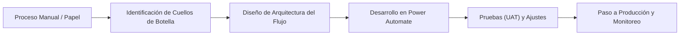

# ⚙️ Power Automate Internal Processes

> Automatización de flujos de trabajo y procesos internos con Power Automate para mejorar la eficiencia operativa y reducir tareas manuales.

## 📝 Objetivo
Digitalizar, estandarizar y automatizar procesos institucionales clave. El propósito es reducir drásticamente las tareas administrativas repetitivas, mejorar la trazabilidad documental y brindar un soporte tecnológico ágil a la gestión operativa diaria.

## 📖 Contexto
Este repositorio presenta un portafolio de casos de automatización *Back-end* (flujos de nube) desarrollados para optimizar la operación institucional. Mediante el uso del ecosistema de Power Platform, se reemplazaron cadenas de correos electrónicos informales y firmas en papel por flujos de aprobación estructurados, integrados directamente con las bases de datos de la institución.

## 💼 Procesos Automatizados
- **Proceso de Cometidos:** Aprobaciones jerárquicas y generación de resoluciones en PDF.
- **Proyecto VAE:** Flujos de revisión académica entre estudiantes y docentes evaluadores.
- **Repactación Estudiantil:** Notificaciones financieras automáticas y validación de acuerdos de pago.
- **Evaluación Docente:** Consolidación de respuestas y envío masivo de resultados.

## 💡 Solución Desarrollada
Se implementaron automatizaciones (*Cloud Flows*) orientadas a:
- Reducción drástica de tareas manuales propensas a errores humanos.
- Estandarización estricta de procesos y reglas de negocio.
- Mejora absoluta en la trazabilidad (auditoría de quién aprobó, cuándo y por qué).
- Agilización de los flujos de comunicación internos entre departamentos.
- Apoyo constante a usuarios finales y áreas operativas críticas.

## 🛠️ Herramientas Utilizadas
- **Motor de Automatización:** Microsoft Power Automate (Flujos programados, automatizados e instantáneos).
- **Aprobaciones:** Acción nativa de *Approvals* (Integrada en Teams y Outlook).
- **Bases de Datos:** Listas de SharePoint (SharePoint Lists), Microsoft Excel (Tablas alojadas en la nube).
- **Comunicación:** Microsoft Outlook, Microsoft Teams.
- **Ecosistema general:** Microsoft Power Platform.

## 🔄 Metodología de Implementación

## 👁️ Vista General de Casos
Este repositorio documenta y resume las arquitecturas de soluciones aplicadas a procesos institucionales reales. Su diseño estuvo enfocado en reducir la carga operativa manual de los administrativos y garantizar la integridad en el flujo documental (creación, revisión, aprobación y archivo definitivo).

## 📚 Documentación Adicional
- 🏢 [Contexto de negocio detallado](docs/business-context.md)
- ⚙️ [Arquitectura de los casos de automatización](docs/automation-cases.md)
- 📈 [Impacto en tiempos de respuesta (SLAs)](docs/impact-and-results.md)

## ⚠️ Consideraciones
Este repositorio presenta una **versión adaptada de arquitecturas y lógicas reales**. Para proteger las políticas internas de la institución, no se exponen correos electrónicos, identificadores de inquilinos (Tenant IDs), ni reglas de negocio confidenciales.

## 📫 Contacto
Si quieres conocer más sobre cómo diseño arquitecturas de automatización en Power Platform o conversar sobre la digitalización de procesos, puedes contactarme:
- 📧 **Email:** [claudio.duran.m@gmail.com](mailto:claudio.duran.m@gmail.com)
- 💼 **LinkedIn:** [Claudio Durán Molina](https://www.linkedin.com/in/claudio-duran-molina-41580677)
