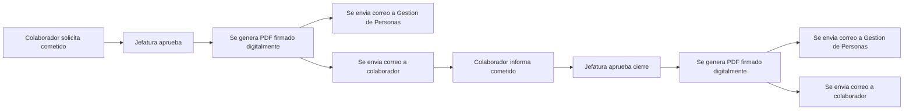
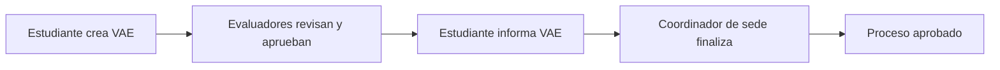
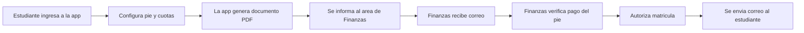
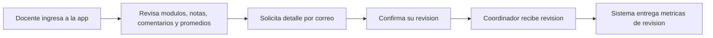

# Casos de automatización

## 1. Cometidos
Automatización del flujo interno de aprobaciones entre colaborador y jefatura. El proceso genera documentos PDF firmados digitalmente y envía correos automáticos a colaborador, jefatura y gestión de personas.

## 2. Proyecto VAE
Automatización del flujo de información entre estudiantes, docentes y evaluadores. Permite gestionar los proyectos realizados por los estudiantes, generar documentos PDF digitales y distribuir correos de manera automática.

## 3. Repactación Estudiantil
Automatización del flujo entre estudiantes y el área de finanzas. El proceso permite generar documentos digitales de repactación y enviar correos automáticos asociados al trámite.

## 4. Evaluación Docente
Automatización del flujo entre docentes y coordinadores. El proceso distribuye correos con documentos PDF de evaluación por docente, facilitando el seguimiento y la gestión documental.

